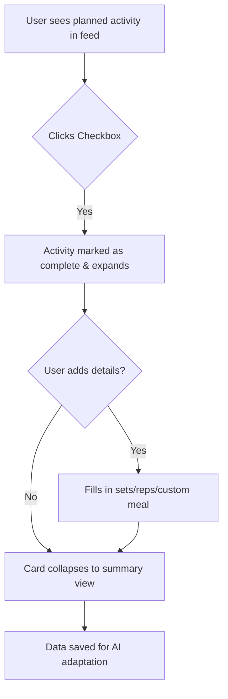

# AI Fitness & Meal Planner UX Design Specification

_Created on søndag 23. november 2025 by BIP_
_Generated using BMad Method - Create UX Design Workflow v1.0_

---

## Executive Summary

To develop a comprehensive, AI-assisted web application that automatically generates and adjusts personalized workout and meal plans, promoting long-term health habits and consistency. The core "magic" is the AI-driven personalization and dynamic adaptation of fitness and meal plans, making healthy living accessible, consistent, and highly engaging through intelligent onboarding, flexible plan adjustments, and user control.

---

## 1. Design System Foundation

### 1.1 Design System Choice

The project will utilize `shadcn/ui` as its core design system, built on top of Tailwind CSS and Radix UI. This choice provides a robust foundation for building accessible, highly customizable, and visually appealing UI components.

**Rationale for `shadcn/ui`:**
- **Customization and Control:** Unlike traditional component libraries, `shadcn/ui` provides direct access to component source code, enabling precise customization and alignment with the unique brand identity of the AI Fitness & Meal Planner. This allows for fine-grained control over styling and behavior using Tailwind CSS.
- **Accessibility (WCAG Compliance):** Leveraging Radix UI primitives, `shadcn/ui` components are designed with accessibility in mind, ensuring adherence to Web Content Accessibility Guidelines (WCAG) for keyboard navigation, focus management, and ARIA attributes. This promotes inclusivity and broadens user reach.
- **Theming:** The system is inherently themeable, simplifying the implementation of features like light/dark mode and allowing for easy application of custom color palettes and typography.
- **Developer Experience:** Its integration with Next.js and Tailwind CSS streamlines the development workflow, enabling faster iteration and consistent UI implementation.

---

## 2. Core User Experience

### 2.1 Defining Experience

### 2.1 Defining Experience

The defining experience is **the feeling of having a personal coach who helps you create suitable meal and workout plans, without the high cost of a human trainer.**

This is not a single interaction, but an overall feeling delivered through a combination of UX patterns:

- **Personalized Onboarding:** The app acts like a coach getting to know a new client, asking the right questions to tailor the initial plan.
- **Proactive Guidance:** Beyond just presenting a plan, the app explains the "why" behind it, offering tips and context, simulating a coach's guidance.
- **Effortless Accountability:** Simple, low-friction logging serves as the "check-in" with the coach, providing the feedback loop for adaptation.
- **Constant Encouragement:** A supportive and motivational tone is used throughout the app, celebrating progress and maintaining engagement.
- **On-Demand Assistance:** The user feels they have an expert in their pocket, ready to adapt the plan whenever needed.

### 2.2 Novel UX Patterns

The core novelty of the application is the **Proactive AI Coaching** pattern. This is not a single interaction, but a design philosophy that shapes how the user and the AI collaborate.

**Core Mechanics:**

1.  **User Goal:** The primary goal for the user is to feel motivated and supported. The "coach" helps them overcome the inertia of starting and maintaining a health routine by providing clear, actionable plans.

2.  **Triggers & Interaction:** The coaching is both proactive and reactive:
    *   **Proactive:** The AI automatically generates new weekly plans based on past performance, acting like a coach preparing for the week ahead.
    *   **Reactive:** The user's actions—logging a workout, rating difficulty, or skipping a meal—trigger the AI to learn and adapt. The user can also explicitly ask for a new plan if the current one isn't suitable.

3.  **Feedback & Success:** The feeling of success is delivered through clear progress visualization. By logging workouts and meals, the user sees their consistency and improvements over time, which the app will present in an easy-to-understand format. This visual feedback is the "pat on the back" from the coach.

4.  **Correction & Control:** If the coaching is unhelpful (i.e., the plan is not suitable), the user has full control. They can reject the AI-generated plan and request a new one. This ensures the user always feels in charge and that their preferences are respected, reinforcing the feeling of a collaborative partnership rather than a dictatorship.

**Experience Details:**

- **Speed:** Interactions with the AI Coach should feel instant. Plan generation and feedback should be delivered without artificial delays to create a sense of efficiency and responsiveness.

- **Delight & Motivation:** Delight will be delivered through a **Reward System**. This system will celebrate user achievements and milestones (e.g., "First week completed!", "30-day streak!", "New personal best!"). These rewards will serve as the primary motivational feedback loop beyond simple progress tracking.

- **Shareability:** The most shareable moments will be the achievements and milestones from the reward system. The design should make these achievements visually appealing and easy to screenshot or share.

- **Platform Consistency:** The core coaching experience will be consistent across all platforms (desktop, tablet). The presentation may adapt to the screen size, but the coaching logic and feedback will remain the same.

- **Social Interaction:** Social features are considered a "Nice to Have" for future versions and are not part of the core MVP experience. The focus is on the individual's journey with their AI coach.

### 2.3 Desired Emotional Response

Users should feel motivated and "tagged and ready to try." The app should foster a sense of activation and sustained engagement.

### 2.4 Inspiration and UX Pattern Analysis

No specific inspirations were provided. We will be creating a unique experience from a clean slate, focusing on first principles to achieve the desired emotional response.

### 2.5 Core Experience Principles

These four principles will guide every design decision to ensure the final product delivers the intended "AI Coach" experience.

- **Effortless & Instant:** The application must feel fast and fluid. Key interactions like generating a plan or logging an activity should be frictionless and without delay.

- **Proactive & Supportive:** The AI Coach should anticipate user needs, offering guidance, context, and encouragement with a consistently supportive tone.

- **User in Control:** The user is the ultimate authority. They must always have the ability to override, reject, or fine-tune the AI's suggestions, ensuring the relationship is a partnership.

- **Motivational & Clear:** Feedback on progress and achievements is paramount. The app will use clear data visualization and a rewarding milestones system to keep users engaged and motivated.

---

## 3. Visual Foundation

### 3.1 Color System

### 3.1 Color System

The application will feature both a **Light Mode** and a **Dark Mode**, allowing users to choose the experience that's most comfortable for them. The brand's primary accent color will be a vibrant, energetic blue, ensuring consistency across both themes.

- **Primary Accent:** `#4299E1` (Energetic Blue)
- **Secondary Accent:** `#63B3ED` (Lighter Blue)

#### Light Mode (Default)
Inspired by the "Energetic & Motivating" theme, the light mode is designed to feel crisp, clean, and optimistic.

- **Background:** `#FFFFFF` (White) / `#F7FAFC` (Subtle Gray)
- **Text:** `#1A202C` (Near Black)
- **Borders & Dividers:** `#E2E8F0`

#### Dark Mode
Inspired by the "Sleek & Professional" theme, the dark mode is focused, easy on the eyes, and feels premium. It uses the same primary blue accent to maintain brand identity.

- **Background:** `#1A202C` (Near Black) / `#2D3748` (Dark Gray)
- **Text:** `#F7FAFC` (Off White)
- **Borders & Dividers:** `#4A5568`

#### Semantic Colors
- **Success:** A clear, accessible green (e.g., `#38A169`)
- **Warning:** An amber/yellow (e.g., `#D69E2E`)
- **Error:** A strong, clear red (e.g., `#E53E3E`)

### 3.2 Typography

The typography is designed for clarity, readability, and a modern feel, using system fonts to ensure performance and consistency across platforms.

- **Font Family (Headings & UI):** A system sans-serif font stack (e.g., -apple-system, BlinkMacSystemFont, "Segoe UI", Roboto).
- **Font Family (Body):** The same system sans-serif font stack for consistency.
- **Font Family (Monospace):** A system monospace font stack for any code or data display.

- **Type Scale:** A responsive and harmonious type scale will be used (e.g., 12px, 14px, 16px, 18px, 20px, 24px, 30px, 36px, 48px).

### 3.3 Spacing & Layout

A consistent spacing and layout system will be used to create a balanced and rhythmic design.

- **Base Unit:** **8px**. All margins, paddings, and layout dimensions will be multiples of 8.
- **Spacing Scale:** A defined scale (e.g., `xs: 4px`, `sm: 8px`, `md: 16px`, `lg: 24px`, `xl: 32px`, `2xl: 48px`) will be used for consistency.
- **Layout Grid:** A standard 12-column grid will be used for all page layouts, ensuring responsive behavior and alignment.

**Interactive Visualizations:**

- Color Theme Explorer: [ux-color-themes.html](./ux-color-themes.html)

---

## 4. Design Direction

### 4.1 Chosen Design Approach

The chosen design direction is **Direction 3: The Coach's Feed**. This approach aligns perfectly with our "Proactive AI Coaching" novel pattern, presenting the user's journey as an evolving, guided conversation.

**Key Characteristics:**
- **Layout:** Chronological timeline/feed-based interface.
- **Density:** Balanced, with clear separation between items, feeling like distinct "messages" or "events."
- **Navigation:** Implicitly driven by scrolling through the feed, but will also incorporate a subtle top or side navigation for overall sections (e.g., "Plan," "Progress," "Profile").
- **Primary action prominence:** Actions (like "Log Workout") will be integrated contextually within the feed items, appearing when relevant.
- **Content Approach:** Narrative and guidance-driven, interleaving plan items, logged activities, coaching tips, and progress updates.

This direction fosters a continuous, engaging dialogue between the user and their AI Coach, making the journey feel personalized and supportive.

**Interactive Mockups:**

- Design Direction Showcase: [ux-design-directions.html](./ux-design-directions.html)

---

## 5. User Journey Flows

The user journey flows are designed to be intuitive, supportive, and efficient, aligning with our "Coach's Feed" design direction and core experience principles.

### 5.1 New User Onboarding

**User Goal:** To securely sign up, provide initial preferences, and receive their first personalized workout and meal plan.

**Approach:** **Wizard/Stepper Approach**

This approach breaks down the onboarding process into clear, sequential steps, guiding the user through necessary profile setup and initial plan generation. This aligns with the "Proactive & Supportive" principle, making a potentially complex process feel effortless.

**Flow Steps:**

1.  **Sign Up & Login:**
    *   **User sees:** Standard sign-up/login interface.
    *   **User does:** Enters email, password, confirms email.
    *   **System responds:** Account created, email verification initiated.

2.  **Welcome & Intro:**
    *   **User sees:** A friendly welcome screen introducing the AI Fitness & Meal Planner, highlighting benefits.
    *   **User does:** Proceeds to the next step.
    *   **System responds:** Initiates the guided profile setup.

3.  **Profile Setup (Multi-Step Wizard):**
    *   **User sees:** A sequence of screens (e.g., "Step 1 of 4: Personal Details," "Step 2 of 4: Fitness Goals," "Step 3 of 4: Dietary Preferences"). Each step presents a concise form for relevant input. A progress indicator is visible.
    *   **User does:** Provides personal details (name, age, body metrics - as needed by AI), selects fitness goals (weight loss, muscle gain), and chooses dietary preferences (vegetarian, allergies).
    *   **System responds:** Progresses through steps, validates input.

4.  **Fitness Persona Selection:**
    *   **User sees:** A prompt to select a "Fitness Persona" (e.g., "Just starting," "Getting back in shape," "Ready for a challenge") to help calibrate the AI. This is a crucial step for personalized plan generation.
    *   **User does:** Selects the most relevant persona.
    *   **System responds:** Acknowledges selection, prepares for plan generation.

5.  **First Plan Generation & Display:**
    *   **User sees:** A loading screen (brief, given our "Instant" principle) with an encouraging message like "Your AI Coach is crafting your first diagnostic plan..."
    *   **User does:** Waits briefly.
    *   **System responds:** Displays the personalized "diagnostic" first-week plan directly on the main dashboard, along with a toast notification: "Welcome! Here is your first 'diagnostic' plan. Your feedback this week will help us calibrate the AI to your unique fitness level."

**Mermaid Diagram:**

```mermaid
graph TD
    A[User Signs Up & Logs In] --> B{Email Verified?};
    B -- Yes --> C[Welcome Screen];
    C --> D[Multi-step Profile Setup (Wizard)];
    D -- Step 1: Personal Details --> E[Step 2: Fitness Goals];
    E --> F[Step 3: Dietary Preferences];
    F --> G[Select Fitness Persona];
    G --> H[AI Generates First Plan];
    H --> I[Dashboard with First Plan Displayed];
    B -- No --> J[Prompt for Email Verification];
    J --> B;
```

### 5.2 Logging Workouts/Meals

**User Goal:** To quickly and easily record completed activities (both planned and unplanned) and provide detailed feedback for AI adaptation.

**Approach:** **Inline Expansion**

This approach provides the instant gratification of a simple checkbox while allowing for optional, detailed data entry without leaving the context of the "Coach's Feed."

**Flow Steps:**

1.  **Initiate Logging:**
    *   **User sees:** A planned workout or meal card in their feed with a prominent checkbox.
    *   **User does:** Clicks the checkbox to mark the item as complete.
    *   **System responds:** The checkbox is instantly filled, providing immediate positive feedback. The card item smoothly expands to reveal options for more detail.

2.  **Provide Details (Optional):**
    *   **User sees:** After expansion, fields for `sets`, `reps`, `weight` (for strength workouts), and a general `notes` section appear. For meals, an option to "Log a different meal" is visible.
    *   **User does:** Can either ignore the fields and scroll on, or fill in the details of their workout. If they ate something else, they can describe the unplanned meal.
    *   **System responds:** Input is saved automatically as the user types or when they click away.

3.  **Confirmation:**
    *   **User sees:** The feed item updates to a "logged" state, summarizing the key details (e.g., "Workout Logged: 3 sets of 10 reps"). The card might shrink back to a compact summary view.
    *   **User does:** Continues scrolling their feed.
    *   **System responds:** The logged data is securely saved and will be used by the AI for the next weekly replanning cycle. A "motivational" element, like a small reward or encouraging message from the coach, may appear in the feed.

**Mermaid Diagram:**



---

## 6. Component Library

### 6.1 Component Strategy

## 6. Component Library

### 6.1 Component Strategy

The component library strategy is to leverage our chosen design system for standard components and create a single, highly-specialized custom component for our unique "Coach's Feed" interface.

- **Base Components:** All standard UI elements (Buttons, Forms, Inputs, Modals, Menus, etc.) will be implemented using **`shadcn/ui`**. This ensures consistency, accessibility, and adherence to our visual foundation.

- **Custom Component:** The primary custom component for the application is the **`HybridFeedCard`**.

### 6.2 Custom Component: HybridFeedCard

This component is the core of the user experience, designed to be versatile enough to handle all events within the user's feed. It combines the clear, information-rich layout of a structured card with the personal, conversational feel of an avatar-based bubble.

**Anatomy:**

1.  **Header:** Contains an **Avatar** icon to signify the "author" of the event (Coach, User, or System) and a clear **Title**.
2.  **Body:** A flexible content area for text, lists, or data related to the event.
3.  **Actions (Optional):** A footer area containing contextual buttons (e.g., "Log Workout," "See Details," "Share Achievement").

**Variants:**

The appearance of the card, particularly the avatar and accent colors, will change based on the event type to make the feed instantly scannable.

- **Coach Variant (🤖):**
    - **Purpose:** For new plans, coaching tips, questions, and messages from the AI.
    - **Styling:** Uses the primary blue accent color. The avatar shows a robot icon.
    - **Example Title:** "Your New Weekly Plan is Ready!"

- **User Log Variant (👍):**
    - **Purpose:** To represent actions taken by the user, such as a logged workout or meal.
    - **Styling:** Uses the semantic "success" green accent color. The avatar shows a thumbs-up or checkmark.
    - **Example Title:** "Workout Logged: Full Body Strength"

- **Reward Variant (🏆):**
    - **Purpose:** To celebrate milestones, completed goals, and streaks.
    - **Styling:** Uses a distinct gold or yellow accent color to feel special. The avatar shows a trophy or star icon.
    - **Example Title:** "Achievement Unlocked: 5-Day Streak!"

---

## 7. UX Pattern Decisions

The following UX pattern decisions will ensure consistency and a predictable user experience across the application.

### 7.1 Button Hierarchy

Buttons will be styled according to their importance and action, guiding the user's attention and preventing misclicks on critical actions.

- **Primary Action:** Solid background with our primary blue (`#4299E1`). Used for the most important, affirmative action on a screen (e.g., "Save," "Generate Plan," "Confirm").
- **Secondary Action:** Transparent background with a blue border and blue text (`#4299E1`). Used for less critical actions, or to present alternatives to the primary action (e.g., "Cancel," "View Details," "Edit Profile").
- **Destructive Action:** Solid red background (e.g., `#E53E3E`) with white text. Used for actions that are irreversible or carry significant consequences (e.g., "Delete Account," "Remove Plan").

### 7.2 Feedback Patterns

The application will provide clear, timely, and non-intrusive feedback to users, ensuring they understand the system's state without being interrupted.

- **Success Notifications:** Will use a **Toast/Snackbar** notification (brief, non-modal message) appearing from the bottom or top of the screen. Example: "Workout logged successfully!"
- **Error Notifications:**
    - **Form Validation Errors:** Displayed **inline** directly below the affected input field, clearly indicating the issue (e.g., "This field is required").
    - **System/API Errors:** Will use a red-themed **Toast/Snackbar** notification for non-critical issues (e.g., "Failed to load data, please try again."). For critical, blocking errors, a modal dialog may be used.
- **Loading Indicators:**
    - **Content Loading:** For areas where content is fetching (e.g., a FeedItemCard loading its details), subtle **Skeleton Loaders** (gray, pulsing placeholders) will be used to indicate content is coming.
    - **Action Processing:** For actions that take a moment (e.g., "Generating Plan"), a small **Spinner** or progress bar will be shown contextually (e.g., within the button itself, or a small animation on the card).

### 7.3 Form Patterns

Forms will be designed for clarity, accessibility, and ease of use.

- **Label Position:** Placed **above** the input field for maximum scannability and accessibility.
- **Required Field Indicator:** A small asterisk `*` will be used next to the label of required fields.
- **Validation Timing:** Validation will occur **on blur** (when a user leaves a field) to provide immediate feedback, with a final validation of the entire form **on submit**.
- **Help Text:** Any additional instructional text will appear subtly below the input field.

### 7.4 Modal Patterns

Modals will be used for focused tasks that require blocking the main interface.

- **Size Variants:** Modals will come in `Small`, `Medium`, and `Large` sizes to suit the content. On mobile, they will adapt to a full-screen pattern.
- **Dismiss Behavior:** Users can close a modal by **clicking the overlay**, pressing the **Escape key**, or clicking an explicit **"Close" (X) or "Cancel" button**.
- **Focus Management:** Keyboard focus will be automatically trapped within the modal and moved to the first interactive element upon opening.

### 7.5 Navigation Patterns

Navigation will be clear, predictable, and consistent across the application.

- **Active State Indication:** The current, active navigation link will have a clear visual highlight (e.g., a solid background color or a bolded, colored font).
- **Back Button Behavior:** The browser's native back button will function as expected. For in-app flows that require a step back (e.g., in a multi-step modal), a clear "Back" button will be provided.
- **Breadcrumbs:** Will be used sparingly, only for deeply nested settings pages where a user might lose their sense of place. They will not be used for primary application navigation.

### 7.6 Empty State Patterns

Empty states will be designed to be helpful, guiding, and encouraging, turning a blank screen into a positive opportunity.

- **First Use:** The initial empty feed will feature a prominent welcome message from the AI Coach, guiding the user to complete their profile to generate their first plan.
- **No Results:** In cases like a search with no results, a simple "No results found" message will be displayed, along with suggestions for alternative search terms.
- **All Content Cleared:** If a user clears a significant amount of data, an encouraging message like "Ready for a fresh start!" will be shown, with a clear call-to-action to generate a new plan.

### 7.7 Confirmation Patterns

Confirmations will be used to prevent accidental data loss or irreversible actions, providing a safety net for the user.

- **Destructive Actions:** Actions like deleting an account will be protected by a **Confirmation Modal**. This modal will clearly state the consequences and require the user to type a confirmation word (e.g., "DELETE") to proceed.
- **Unsaved Changes:** When a user attempts to navigate away from a form with unsaved changes, the browser's native "Are you sure you want to leave?" prompt will be used to prevent data loss.

---

## 8. Responsive Design & Accessibility

### 8.1 Responsive Strategy

The application will be designed with a robust responsive and accessibility strategy to ensure a consistent and inclusive user experience across various devices and for all users.

### 8.1 Responsive Strategy

The "Coach's Feed" design, being primarily a single-column layout, is inherently responsive. The main adaptations will focus on optimizing navigation for different screen sizes.

-   **Desktop/Laptop (1024px+):**
    -   **Navigation:** A persistent **sidebar** will be visible on the left, displaying primary navigation links (e.g., Dashboard, Plan, Progress, Profile).
    -   **Content:** The main "Coach's Feed" will occupy the central content area, providing ample space for cards and details.
    -   **Layout:** May include secondary content areas or widgets on the right if applicable.

-   **Tablet (768px - 1023px):**
    -   **Navigation:** The sidebar will collapse into a **hamburger menu icon (☰)**, typically placed in the top-left or top-right corner, to maximize screen real estate for the feed.
    -   **Content:** The "Coach's Feed" will expand to fill the available width.
    -   **Interactions:** Touch-friendly interactions will be prioritized.

-   **Mobile (375px - 767px - future phase):**
    -   **Navigation:** A **bottom tab bar** will be implemented for primary navigation, providing easy access to key sections with a thumb. The hamburger menu will be available for secondary options.
    -   **Content:** The "Coach's Feed" will be fully fluid and occupy the entire width, with cards adapting to a single-column display.
    -   **Interactions:** All components will be designed with appropriate touch target sizes.

### 8.2 Accessibility Strategy

The application is committed to providing an inclusive experience for all users, adhering to recognized accessibility standards.

-   **Compliance Target:** **WCAG 2.1 Level AA**
    -   This level is considered the industry standard for web accessibility and is often legally required for public-facing applications. Achieving Level AA ensures a broad range of accessibility issues are addressed, making the application usable for individuals with various disabilities.

-   **Key Requirements:**
    -   **Keyboard Navigation:** All interactive elements will be fully navigable and operable using only a keyboard.
    -   **Focus Indicators:** Clear and visible focus states will be provided for all interactive elements, making it easy for keyboard users to track their position.
    -   **ARIA Labels & Roles:** Appropriate ARIA (Accessible Rich Internet Applications) attributes and roles will be used to provide semantic meaning to UI elements for screen readers.
    -   **Alt Text:** All meaningful images will include descriptive alternative text.
    -   **Color Contrast:** Color combinations will meet or exceed WCAG Level AA contrast ratios for text and graphical elements, ensuring readability for users with low vision or color blindness.
    -   **Forms:** Form fields will have properly associated labels, and error messages will be clear and programmatically linked to their fields.
    -   **Responsiveness:** The responsive design will maintain accessibility across different device sizes, avoiding content loss or un-interactable elements.
    -   **Testing:** Accessibility will be integrated into the development and testing process, utilizing automated tools (e.g., Lighthouse, axe DevTools) and manual keyboard/screen reader testing.

---

## 9. Implementation Guidance

### 9.1 Completion Summary

{{completion_summary}}

---

## Appendix

### Related Documents

- Product Requirements: `docs/PRD.md`
- Product Brief: `docs/Fase-1-analysis/product-brief-AI Fitness & Meal Planner-søndag 9. november 2025.md`
- Brainstorming: `docs/Fase-1-analysis/brainstorming-session-results-søndag 9. november 2025.md`

### Core Interactive Deliverables

This UX Design Specification was created through visual collaboration:

- **Color Theme Visualizer**: {{color_themes_html}}
  - Interactive HTML showing all color theme options explored
  - Live UI component examples in each theme
  - Side-by-side comparison and semantic color usage

- **Design Direction Mockups**: {{design_directions_html}}
  - Interactive HTML with 6-8 complete design approaches
  - Full-screen mockups of key screens
  - Design philosophy and rationale for each direction

### Optional Enhancement Deliverables

_This section will be populated if additional UX artifacts are generated through follow-up workflows._

<!-- Additional deliverables added here by other workflows -->

### Next Steps & Follow-Up Workflows

This UX Design Specification can serve as input to:

- **Wireframe Generation Workflow** - Create detailed wireframes from user flows
- **Figma Design Workflow** - Generate Figma files via MCP integration
- **Interactive Prototype Workflow** - Build clickable HTML prototypes
- **Component Showcase Workflow** - Create interactive component library
- **AI Frontend Prompt Workflow** - Generate prompts for v0, Lovable, Bolt, etc.
- **Solution Architecture Workflow** - Define technical architecture with UX context

### Version History

| Date     | Version | Changes                         | Author        |
| -------- | ------- | ------------------------------- | ------------- |
| søndag 23. november 2025 | 1.0     | Initial UX Design Specification | BIP |

---

_This UX Design Specification was created through collaborative design facilitation, not template generation. All decisions were made with user input and are documented with rationale._
